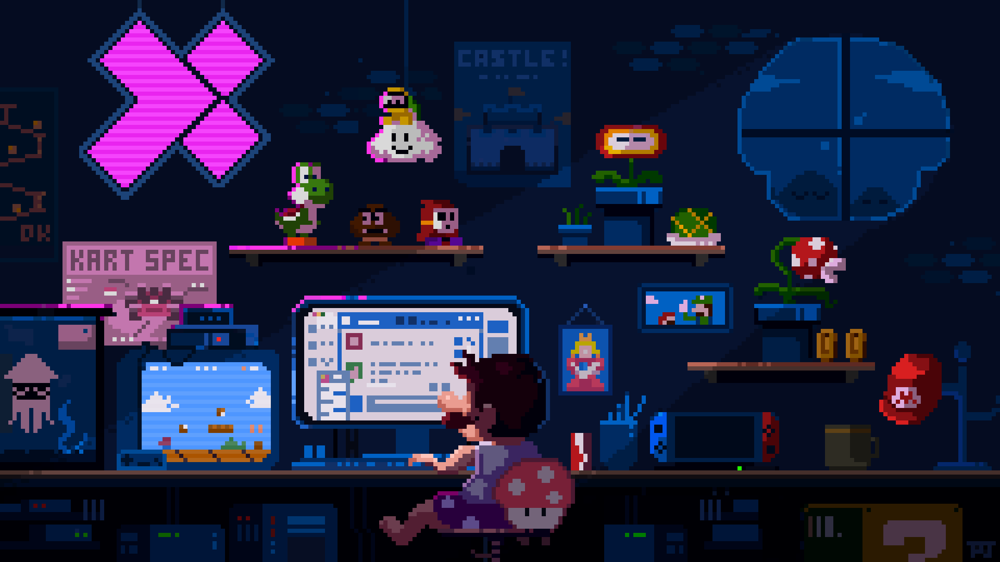

<h1 align="center">
    
</h1>
<h2 align="center">You may delay, but time will not.</h2>
 

 

  

<h1> About Me </h1>

- 🎓 I'm a student at **FPT University Quy Nhơn AI Campus**.

- 🔭 I’m currently learning **Backend NodeJS**

- ❤️ I'm passionate about:
  - 🪐 Operating Systems (Windows)
  - 🖥️ Website Developer
 
 

    

 
<h1>  Languages - Frameworks & Libraries - Tools </h1>

 

      
      
     

 
<h1>  My Contributions </h1>

    

 
<h1>  Connect with me </h1>

 

  
  
  

 

<h1>  Support Me </h1>

  

 

