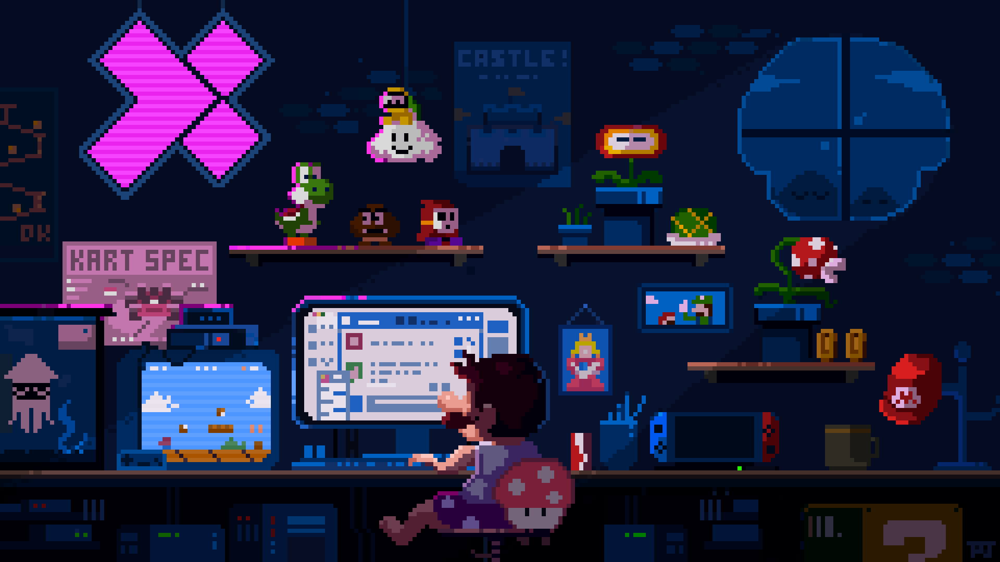
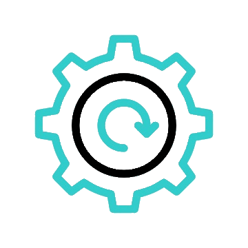
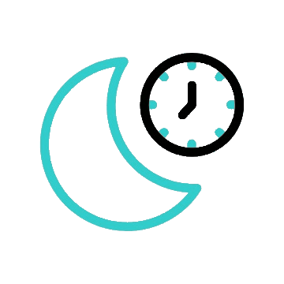
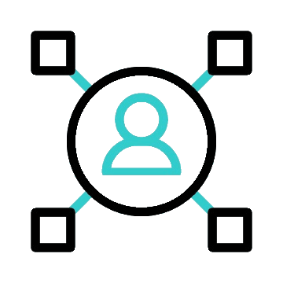
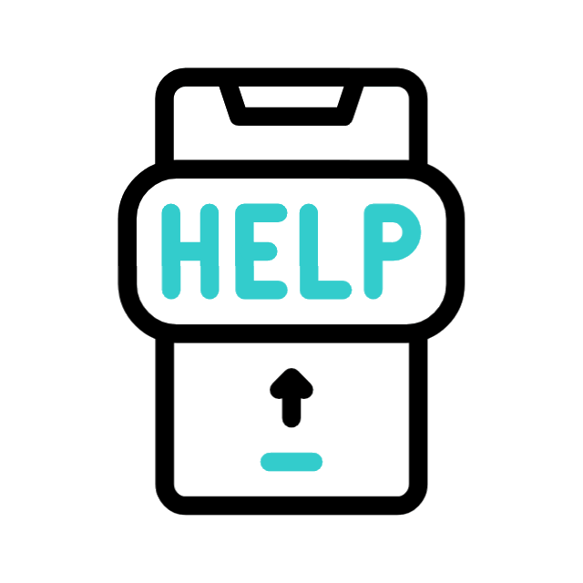

<h1 align="center">
    
</h1>
<h2 align="center">You may delay, but time will not.</h2>
 

 

  

<h1> About Me </h1>

- 🎓 **Software Engineer**, graduated from **FPT University Quy Nhơn AI Campus**.

- 💼 **Tech Officer at WeCare Group** — building internal accounting & supply-chain automation on the Microsoft Power Platform + Azure (6+ months).

- 🔭 Currently going deeper into **Backend Node.js**.

 

  

 
<h1>  Languages - Frameworks & Libraries - Tools </h1>

 

      
      
     

 
<h3 align="center">🏢 Work Stack · Microsoft Power Platform & Azure</h3>

  
  
  
  
  
  
    
  
  
  
  
  
  

 
<h1>  My Contributions </h1>

    

 
<h1>  Connect with me </h1>

 

  
  
  

 

<h1>  Support Me </h1>

  

 

